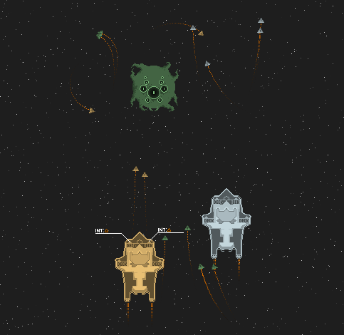

Tripping-Octo-Nemesis
=====================

##Plot
**SD055871 - A distant sector of the galaxy**

You are in your stateroom as commander-in-chief Kil'Kina enters. "Rebellion forces are attacking the main cluster. Distress signals were delayed and jammed; were the only space station in range to send relief. You must depart at once." Knowing that you are outgunned and outnumbered you set out for the cluster, hoping to turn the tide in an almost lost battle...

##Gameplay
You are the captain of an heavy spacecraft carrier alongside another carrier controlled by a second player. As you advance further into space you encounter rebellion forces, asteroids and merchants. Most times you will be fighting enemy forces by directing up to 8 spacecrafts - called flyer - while managing the carrier's resources: Should you deploy all flyer at once, risking to sacrifice some in the process, or switching damaged flyers and freshly repaired ones, staking your carrier's hull - it's your choice. There are of course different types of flyers: Use Bombers to inflict heavy damage from a distance, command Glares to disable enemy weapon systems or jump from encounter to encounter with Jets.
When combat becomes to complex, invite some more friends to take over control of the flyers - you just need enough keyboards or gamepads.

Besides combat you also develop new ships, weapons and improvements to keep your fleet up-to-date. Discover new ship types or improvements like anti-missile systems, energy shields and afterburners. However don't neglect to maintain your fleet: Shiny new missiles might lacerate the heavy enemy carrier you're facing but those fast fighters will pierce your hull in no time without a proper air defence!
View the [Feature List](https://github.com/Elayn/tripping-octo-nemesis/wiki/Feature-List) for a more detailed description.

##Controls
Player One  

- `WASD` Move your carrier
- `Left Shift` + `WS` Move your cursor
- `1234` Deploy your flyers
- `Left Shift` + `1234` Recall your flyers

Player Two  

- `Left, Right, Up, Down` Move your carrier
- `Numpad 0` + `Up, Down` Move your cursor
- `Numpad 1234` Deploy your flyers
- `Numpad 0` + `Numpad 1234` Recall your flyers

##Get It

###Builds
If you want to give it a try, you can download the Tripping-Octo-Nemesis binaries here:  
http://db.tt/0BI1ZwCm

You also need the Microsoft XNA Framework Redistributable 4.0:  
http://www.microsoft.com/en-us/download/details.aspx?id=20914

###Source
If you're interested in the code, just download it via GitHub. You may notice that a library is missing, so you can't compile the code (without the effort of coding the missing game lib yourself or just using the .dll from the binaries :P). That is because the source code of Tripping-Octo-Nemesis is released under the [MS-RS License](http://referencesource.microsoft.com/referencesourcelicense.aspx): You may read it (e.g. to learn something from it or to yell at me), but you may not distribute or modify the code for commercial or non-commercial purposes.
